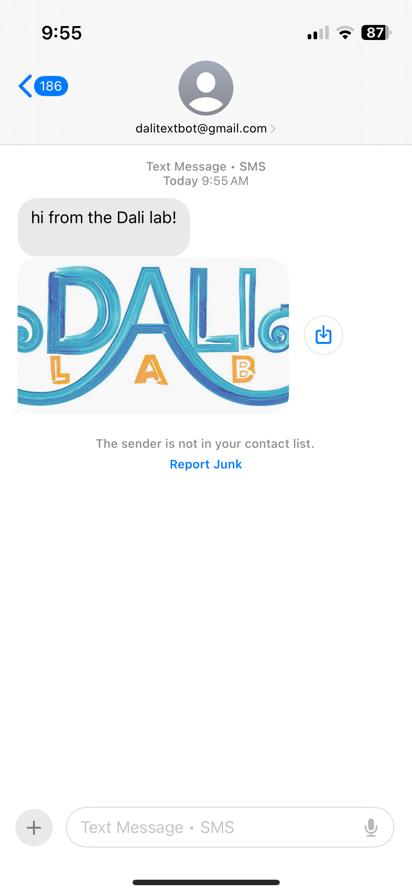

# Textbot for Dali Lab Application

# Project Features

* Sends SMS and MMS messages to any US-based phone 
* Able to transmit attachments (images, videos, etc.)
* Ability to schedule send messages 
    * Schedule, view, and deschedule SMS and MMS messages  
* Interactive command line functionality 

## Project Overview
Textbot

This project creates a "textbot" that uses single mail transfer protocol (SMTP) to send text messages to US-based phone 
numbers. The project uses Multipurpose Internet Mail Extensions (MIME) messages to send both SMS and MMS texts. For use,
the project comes with a basic shell complete with user instructions. 

## Screenshots



## Setup Instructions
clone the repository
```bash
git clone https://github.com/Kiran-Jones/textbot.git
cd textbot
```

## Run the Project Locally
```bash
python TextMessageInterface.py
```
## Learning Process
While this project is simple in some ways, I learned a lot from working on it. The initial source of inspiration for
this was Twilio. I wanted to send my phone text messages from my computer to my phone, and found the Twilio API
more difficult than I wanted to work with. Also, I was curious about the technology behind this process. 

In my research for this project, I discovered SMTP and the ability to send emails and have them be received as texts. I 
had a basic understanding of how to operate mail with python, and saw this as the perfect solution for my project. I 
made use of a file of SMTP addresses of US-based carriers from [Alfredo Sequeida's GitHub](https://github.com/alfredosequeida) 
for this process. 

In its current implementation, the program is unable to determine the carrier of a phone number. To get around this
limitation, it sends emails to every SMTP address, and the invalid messages (e.g. to carriers other than the correct one)
bounce back. Tracking these bounces is very difficult (their delay is not always consistent, and mail services can 
restrict access to stop spammers), and would be a great area to focus on for future improvements. There are also online 
APIs that give this information, however, they are not always reliable and frequently relay incorrect or old information.

This project also makes uses of threading to run the message sender and message interface concurrently. I had not used 
threading in Python before this project, and I was able to gain experience doing so throughout the building process.


